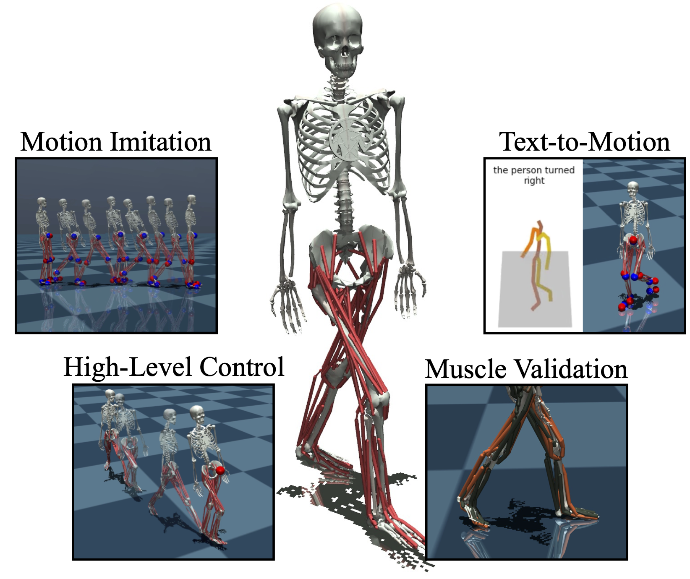

# KINESIS: Reinforcement Learning-Based Motion Imitation for Physiologically Plausible Musculoskeletal Motor Control

<p align="center">
  
</p>

## Overview

KINESIS is a model-free reinforcement learning framework for physiologically plausible musculoskeletal motor control. Using a musculoskeletal model of the lower body with 80 muscle actuators and 20 degrees of freedom, KINESIS achieves strong imitation performance on motion capture data, is controllable via natural language, and can be fine-tuned for high-level tasks like goal-directed movement.

Importantly, KINESIS generates muscle activity patterns that correlate well with human electromyography (EMG) data, making it a promising model for tackling challenging problems in human motor control theory.

> **Note:** The code and datasets will be available soon!

## Demonstrations

### Motion Imitation
<table>
  <tr>
    <td></td>
    <td></td>
    <td></td>
    <td></td>
    <td></td>
  </tr>
</table>

<!-- ## Demonstrations

<table>
  <tr>
    <td></td>
    <td></td>
  </tr>
  <tr>
    <td align="center"><b>Motion Imitation</b></td>
    <td align="center"><b>Text-to-Motion Control</b></td>
  </tr>
  <tr>
    <td></td>
    <td></td>
  </tr>
  <tr>
    <td align="center"><b>High-Level Goal-Directed Control</b></td>
    <td align="center"><b>Muscle Activity Validation</b></td>
  </tr>
</table> -->

## Installation

Instructions for installation will be provided once the code is released.

## Usage

Example usage scripts will be available with the code release.

## Citation

If you find this work useful in your research, please consider citing our paper:

```bibtex
@article{simos2025kinesis,
  title={Reinforcement learning-based motion imitation for physiologically plausible musculoskeletal motor control},
  author={Simos, Merkourios and Chiappa, Alberto Silvio and Mathis, Alexander},
  journal={},
  year={2025}
}
```

## Acknowledgements

This project was funded by Swiss SNF grant (310030 212516). We thank members of the Mathis Group for helpful feedback.

## License

This project is licensed under the MIT License - see the [LICENSE](LICENSE) file for details.